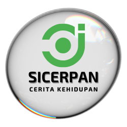
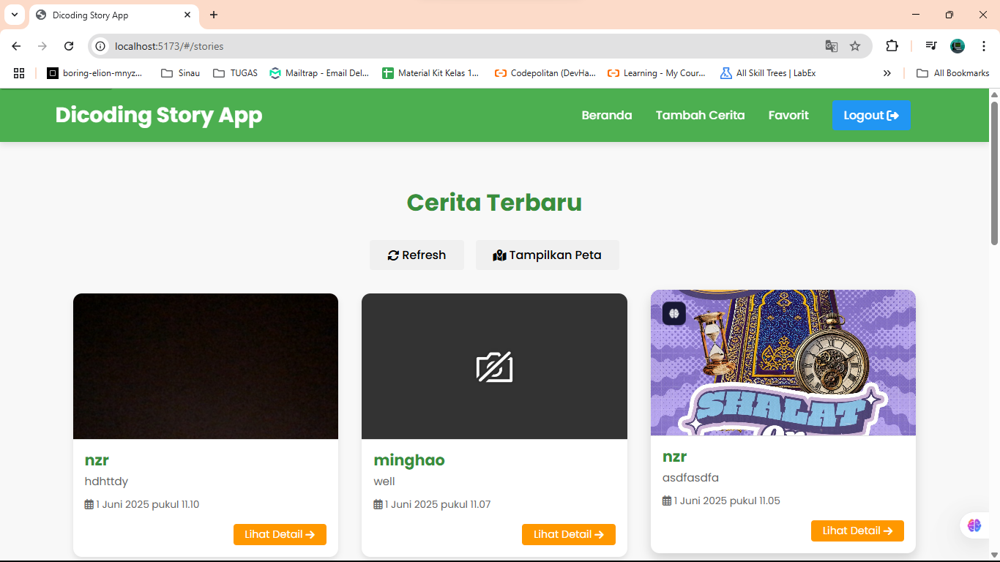
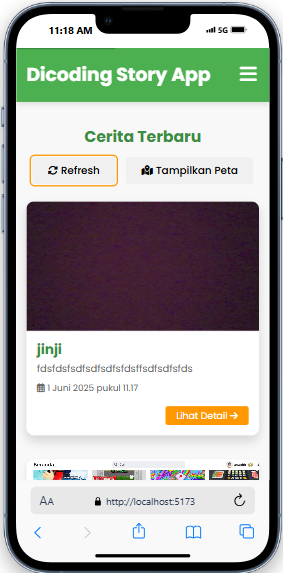

# Dicoding Story App: Ekspresikan Dirimu, Bagikan Ceritamu! 🚀



## Pendahuluan

Selamat datang di **Dicoding Story App**! Sebuah aplikasi web progresif (PWA) yang memungkinkan Anda berbagi cerita momen-momen spesial, mirip dengan platform media sosial populer, namun difokuskan khusus untuk komunitas Dicoding. Dengan desain yang responsif, fitur offline, dan notifikasi pintar, Anda tidak akan pernah ketinggalan cerita terbaru!

Aplikasi ini dibangun sebagai proyek submission untuk program belajar di Dicoding, menerapkan praktik terbaik pengembangan web modern, termasuk Single Page Application (SPA), aksesibilitas, Progressive Web App (PWA), dan Workbox.

## Fitur Utama ✨

* **Berbagi Cerita:** Unggah cerita Anda dengan deskripsi dan foto, bahkan bisa menambahkan lokasi.
* **Daftar Cerita:** Lihat semua cerita terbaru dari pengguna lain dalam tampilan yang menarik.
* **Detail Cerita:** Jelajahi setiap cerita dengan detail lengkap, termasuk lokasi di peta interaktif (jika tersedia).
* **Manajemen Akun:** Mudah mendaftar dan masuk ke akun Anda.
* **Cerita Favorit (Offline-First):** Simpan cerita favorit Anda di IndexedDB dan akses kapan saja, bahkan saat offline!
    * **Menyimpan:** Tambahkan cerita ke favorit dari halaman detail.
    * **Menampilkan:** Lihat semua cerita favorit di halaman khusus.
    * **Menghapus:** Hapus cerita dari daftar favorit Anda.
* **Progressive Web App (PWA):**
    * **Installable:** Tambahkan aplikasi ke layar beranda perangkat Anda untuk pengalaman *native*.
    * **Offline Access:** Tetap bisa melihat konten yang sudah di-*cache* meskipun tanpa koneksi internet.
    * **Application Shell:** UI dasar aplikasi selalu tersedia dengan cepat.
* **Push Notifications:** Dapatkan notifikasi *real-time* saat cerita baru dibuat (setelah Anda mengizinkan notifikasi).
* **Shortcuts Aksi Cepat:** Langsung menuju fitur favorit dari ikon aplikasi Anda (misal: "Tambah Cerita Baru").
    
* **Aksesibilitas Tinggi:** Dirancang dengan standar aksesibilitas web (Skip to Content, Semantic HTML, ARIA labels) untuk semua pengguna.
* **Transisi Halaman Halus:** Navigasi yang mulus dan modern untuk pengalaman pengguna yang menyenangkan.
* **Responsif:** Tampilan yang adaptif di berbagai ukuran perangkat, dari mobile hingga desktop.
    
    
* **Halaman Not Found:** Memberi tahu pengguna jika mereka mengakses rute yang tidak valid.

## Demo Aplikasi 🎬

Anda dapat mencoba aplikasi ini secara langsung (jika sudah di-*deploy*) di:
[Link Demo Anda di GitHub Pages/Netlify/Vercel]

## Instalasi dan Setup Lokal 🛠️

Ikuti langkah-langkah sederhana ini untuk menjalankan aplikasi di lingkungan lokal Anda:

1.  **Clone Repositori:**
    ```bash
    git clone [URL_REPOSITORI_ANDA]
    cd dicoding-story-app
    ```

2.  **Instal Dependensi:**
    Pastikan Anda memiliki Node.js dan npm/Yarn terinstal.
    ```bash
    npm install
    # atau
    yarn install
    ```

3.  **Konfigurasi API Key (MapTiler):**
    Aplikasi ini menggunakan MapTiler untuk peta.
    * Daftar di [MapTiler](https://www.maptiler.com/) untuk mendapatkan API Key Anda.
    * Buat file `.env` di **root** proyek Anda (sejajar dengan `package.json`).
    * Tambahkan baris berikut di file `.env` (ganti `YOUR_ACTUAL_MAPTILER_API_KEY` dengan kunci Anda):
        ```
        VITE_MAPTILER_API_KEY=YOUR_ACTUAL_MAPTILER_API_KEY
        ```
4.  **Siapkan Aset PWA (Ikon & Screenshot):**
    Pastikan semua aset gambar berikut ada di lokasi fisik yang benar, sesuai dengan yang dikonfigurasi di `vite.config.js`:
    * `src/public/favicon.ico`
    * **Folder `src/public/icons/`**:
        * `pwa-192x192.png` (Ukuran: 192x192px)
        * `pwa-512x512.png` (Ukuran: 512x512px, juga untuk `maskable` icon)
        * `apple-touch-icon.png` (Ukuran: 180x180px)
        * `add-story-icon.png` (Ukuran: 192x192px, untuk shortcut)
    * **Folder `src/public/screenshots/`**:
        * `desktop-screenshot.png` (Ukuran: 1280x800px)
        * `mobile-screenshot.png` (Ukuran: 750x1334px)

5.  **Jalankan Aplikasi:**
    ```bash
    npm run dev
    # atau
    yarn dev
    ```
    Aplikasi akan terbuka di `http://localhost:5173` (atau port lain yang tersedia).

## Penggunaan Aplikasi 🚀

1.  **Registrasi / Login:** Daftar akun baru atau masuk dengan kredensial Anda.
2.  **Lihat Cerita:** Jelajahi daftar cerita terbaru di halaman beranda.
3.  **Tambah Cerita:** Klik "Tambah Cerita" untuk membuat postingan baru dengan deskripsi, foto dari kamera/galeri, dan lokasi opsional di peta.
4.  **Lihat Detail:** Klik "Lihat Detail" pada kartu cerita untuk informasi lebih lanjut.
5.  **Favorit:** Di halaman detail cerita, klik "Tambah ke Favorit" untuk menyimpan cerita secara offline.
6.  **Lihat Favorit:** Klik "Favorit" di navigasi untuk melihat cerita yang Anda simpan.
7.  **Install PWA:** Ikuti petunjuk di *address bar* browser Anda untuk menginstal aplikasi ke perangkat Anda.

## Struktur Proyek 📂

Anda benar! Preview seperti itu menunjukkan bahwa format Markdown untuk struktur pohon folder tidak diinterpretasikan dengan benar oleh viewer Markdown Anda. Itu terlihat seperti satu baris panjang atau daftar item yang tidak terindentasi dengan benar.

Ini biasanya terjadi karena dua alasan:

Anda tidak menyertakan tiga backtick (```) di awal dan akhir blok struktur folder.
Viewer Markdown yang Anda gunakan mungkin tidak mendukung indentasi yang terlalu dalam atau format daftar bersarang tanpa blok kode.
Perbaikan (Pastikan Ada Blok Kode Markdown)
Mohon pastikan Anda menyalin seluruh bagian ini, termasuk tiga backtick di awal dan di akhir. Ini akan memberitahu Markdown renderer bahwa itu adalah blok kode, dan akan mempertahankan semua indentasi serta formatnya.

Markdown

## Struktur Proyek 📂

📂 Struktur Proyek  
dicoding-story-app/  
├── node_modules/  
├── public/                     # Lokasi aset statis (akan dicopy ke dist/ saat build)  
│   ├── index.html              # File HTML utama (entry point)  
│   ├── favicon.ico             # Favicon situs  
│   ├── icons/                  # Folder untuk ikon PWA & shortcut  
│   │   ├── add-story-icon.png  
│   │   ├── apple-touch-icon.png  
│   │   ├── pwa-192x192.png  
│   │   └── pwa-512x512.png  
│   └── screenshots/            # Folder screenshot PWA  
│       ├── desktop-screenshot.png  
│       └── mobile-screenshot.png  
├── src/                        # Kode sumber aplikasi JavaScript, CSS  
│   ├── api/                    # Modul untuk interaksi dengan API  
│   │   └── story-api.js  
│   ├── components/             # Komponen UI yang dapat digunakan kembali  
│   │   ├── StoryCard.js  
│   │   ├── Header.js  
│   │   ├── Footer.js  
│   │   └── Spinner.js  
│   ├── pages/                  # Halaman-halaman aplikasi  
│   │   ├── auth/               # Halaman autentikasi  
│   │   │   ├── Login.js  
│   │   │   └── Register.js  
│   │   ├── favorites/          # Halaman cerita favorit (IndexedDB)  
│   │   │   └── FavoriteStories.js  
│   │   ├── stories/            # Halaman cerita utama  
│   │   │   ├── Stories.js  
│   │   │   ├── AddStory.js  
│   │   │   └── DetailStory.js  
│   │   └── NotFound.js         # Halaman 404 Not Found  
│   ├── presenters/             # Logika bisnis (Presenter)  
│   │   ├── AuthPresenter.js  
│   │   ├── StoriesPresenter.js  
│   │   └── AddStoryPresenter.js  
│   ├── utils/                  # Utilitas (Router, IndexedDB, Notifikasi, Kamera)  
│   │   ├── Router.js  
│   │   ├── AuthHelper.js  
│   │   ├── NotificationHelper.js  
│   │   ├── CameraHelper.js  
│   │   └── StoryDb.js  
│   ├── styles/                 # File CSS  
│   │   ├── global.css  
│   │   └── components.css  
│   ├── main.js                 # Entry point JS utama  
│   ├── App.js                  # Struktur aplikasi utama  
│   └── config.js               # Konfigurasi aplikasi  
├── .env                        # Environment variables  
├── vite.config.js              # Konfigurasi Vite & PWA  
├── package.json                # Daftar dependensi  
└── STUDENT.txt                 # API Keys untuk Submission  

## Dependensi Utama 📦

Aplikasi ini menggunakan beberapa dependensi kunci:

* `vite`: Build tool yang cepat.
* `leaflet`: Pustaka interaktif untuk peta.
* `idb`: *Wrapper* IndexedDB yang mudah digunakan.
* `sweetalert2`: Pustaka notifikasi *pop-up* yang cantik.
* `vite-plugin-pwa`: Plugin untuk integrasi PWA dan Workbox.

## Terima Kasih 🙏

Proyek ini dibuat sebagai bagian dari program Dicoding. Terima kasih kepada tim Dicoding dan API Dicoding Story atas materi dan dukungan yang diberikan.

## Lisensi 📄

Dewan22blue-hawk©2025
